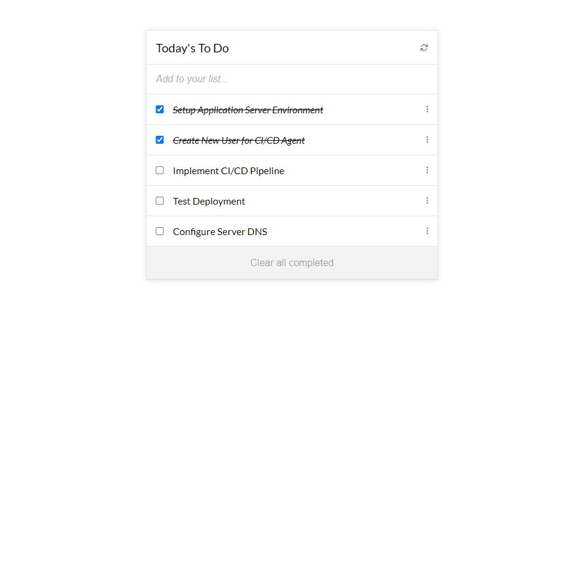

# Todo List



> This is a demo project that helps to manage a todo list. It explores the use of es6 syntax, Javascript modules and Webpack as a module Bundler.

## Built With

- HTML
- CSS
- Javascript
- Webpack


## Live Demo

[Live Demo Link](https://joshuaivie.github.io/MD2-Todo-List/)

## Getting Started

### Prerequisites

- Node
- NPM ( Node Package Manager )
- Git and Github Account

### Setup

- Run git clone on this project at the desired directory:
  ```
  git clone https://github.com/joshuaivie/MD2-Todo-List
  ```
   ```
  npm install
  ```
- Open the index.html in your favorite browser
- Right-click on the website and go to Inspect (Google Chrome) or Inspect Element (Firefox)

### Tests

- **Webhint** linter -`npx hint .` on the root directory.
- **Stylelint** linter - `npx stylelint "**/*.{css,scss}"` on the root directory.
- **ESLint** linter - `npx eslint .` on the root directory.

## Authors

👤 **Joshua Ivie**

- GitHub: [@joshuaivie](https://github.com/joshuaivie)
- Twitter: [@joshuaivie\_](https://twitter.com/joshuaivie_)
- LinkedIn: [joshuaivie](https://linkedin.com/in/joshuaivie)

## 🤝 Contributing

Contributions, issues, and feature requests are welcome!

Feel free to check the [issues page](https://github.com/joshuaivie/MD2-Todo-List/issues).

## Show your support

Give a ⭐️ if you like this project!

## 📝 License

This project is [MIT](./MIT.md) licensed.
